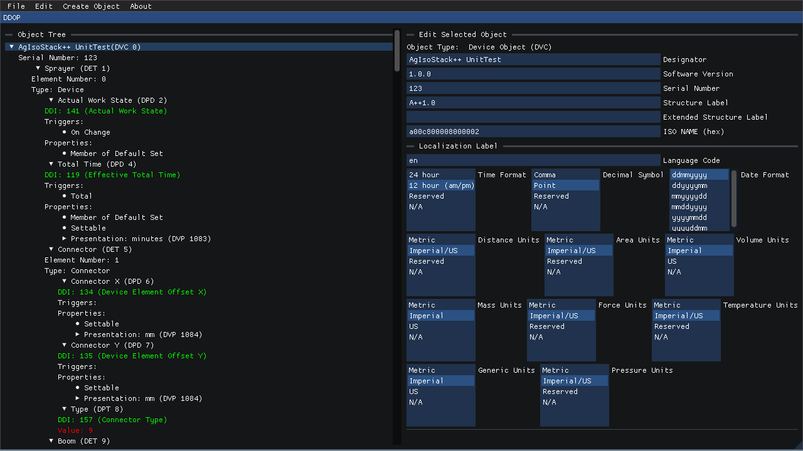

# AgIsoStack DDOP Generator

## Overview

This program allows you to create, save, load, and edit ISO11783 device descriptor object pools (DDOP) for use with communicating with an ISOBUS task controller.

It is written in C++ and is based on the DDOP objects from [AgIsoStack++](https://github.com/Open-Agriculture/AgIsoStack-plus-plus), with a simple GUI created with [Dear ImGui](https://github.com/ocornut/imgui) running on OpenGL3.

When used in combination with AgIsoStack (or any other TC client), it provides an easy way to visualize your DDOP, build a binary version of it, and easily deserialize it back into C++ objects if you want to interact with a DDOP in your own application.



### Features

* Supports dynamically editing any DDOP or creating one from scratch
* Compatible with both TC version 3 and 4, and detects which one a file uses when opening it
* Opens a DDOP passed on the command line, so it can be registered as your `.iop` handler
* Basic object pool error checking to help you find errors before loading onto a TC
* Completely free and open source alternative to many paid products!

### Releases

Prebuilt binaries for Windows, Linux and macOS 11+ (Apple Silicon) are attached to every [release](https://github.com/Open-Agriculture/AgIsoDDOPGenerator/releases).

The Linux binary links SDL2 and OpenGL dynamically and does not bundle them:

```
sudo apt install libsdl2-2.0-0 libopengl0
```

The Linux archive also carries a desktop entry, a MIME definition and the application icon. Install
them to open a DDOP by double-clicking it:

```
sudo install -Dm644 agisoddopgenerator.desktop /usr/share/applications/agisoddopgenerator.desktop
sudo install -Dm644 agisoddopgenerator.xml /usr/share/mime/packages/agisoddopgenerator.xml
sudo install -Dm644 agisoddopgenerator.svg /usr/share/icons/hicolor/scalable/apps/agisoddopgenerator.svg
sudo install -Dm644 agisoddopgenerator.svg /usr/share/icons/hicolor/scalable/mimetypes/application-x-iso11783-ddop.svg
sudo install -Dm755 AgIsoDDOPGenerator /usr/local/bin/AgIsoDDOPGenerator
sudo update-mime-database /usr/share/mime
sudo update-desktop-database /usr/share/applications
sudo gtk-update-icon-cache /usr/share/icons/hicolor
xdg-mime default agisoddopgenerator.desktop application/x-iso11783-ddop
```

The second icon copy is the one file managers look up by MIME type. The last four commands come from
the `shared-mime-info`, `desktop-file-utils`, `libgtk-3-bin` and `xdg-utils` packages.

`cmake --install` installs the same files under `${CMAKE_INSTALL_PREFIX}/share` and does not refresh
the caches.

A DDOP is recognized by its `DVC` header, not the `.iop` extension, which
[AgIsoVirtualTerminal](https://github.com/Open-Agriculture/AgIsoVirtualTerminal) pools also use. Pools
starting with another object are not recognized.

Windows and macOS have no installer or app bundle yet, so pass the file on the command line.

The macOS binary is unsigned, so Gatekeeper quarantines it on download. Keep it in the same folder as the `libSDL2-2.0.0.dylib` from the same archive, and clear the quarantine flag:

```
xattr -dr com.apple.quarantine AgIsoDDOPGenerator
```

### Compilation

This project is built with CMake.

Make sure you have all the dependencies installed.

```
sudo apt install cmake build-essential libgl1-mesa-dev libxext-dev
```

Clone the repo:

```
git clone https://github.com/Open-Agriculture/AgIsoDDOPGenerator.git --recurse-submodules
```

Then compile with CMake:

```
cd AgIsoDDOPGenerator
cmake -S . -B build
cmake --build build
```
