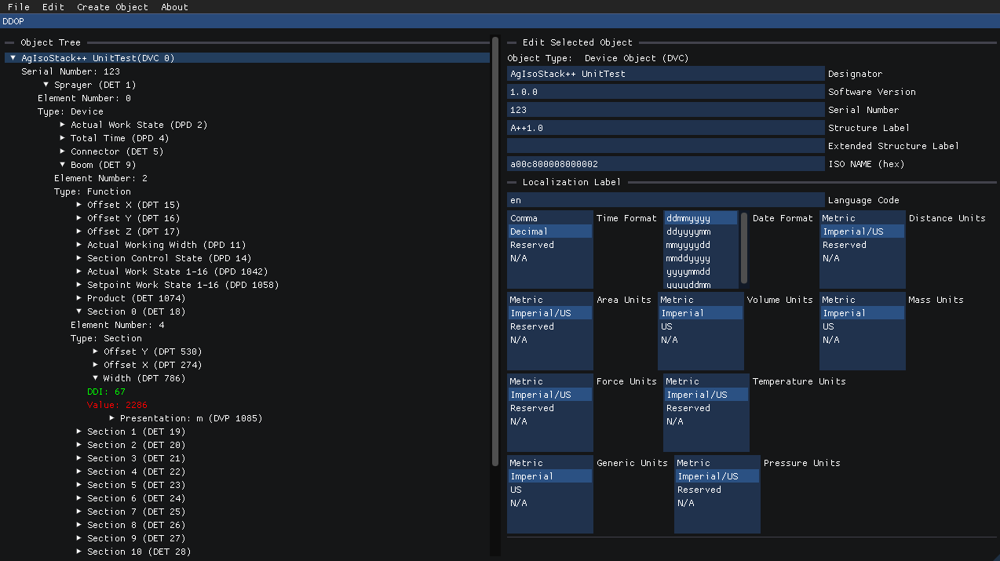

# AgIsoStack DDOP Generator

## Overview

This program allows you to create, save, load, and edit ISO11783 device descriptor object pools (DDOP) for use with communicating with an ISOBUS task controller.

It is written in C++ and is based on the DDOP objects from [AgIsoStack++](https://github.com/Open-Agriculture/AgIsoStack-plus-plus), with a simple GUI created with [Dear ImGui](https://github.com/ocornut/imgui) running on OpenGL3.

When used in combination with AgIsoStack (or any other TC client), it provides an easy way to visualize your DDOP, build a binary version of it, and easily deserialize it back into C++ objects if you want to interact with a DDOP in your own application.



### Features

* Supports dynamically editing any DDOP or creating one from scratch
* Compatible with both TC version 3 and 4
* Basic object pool error checking to help you find errors before loading onto a TC
* Completely free and open source alternative to many paid products!

### Compilation

This project is built with CMake.

Make sure you have all the dependencies installed.

```
sudo apt install cmake build-essential
```

Then compile with CMake:

```
cmake -S . -B build
cmake --build build
```
